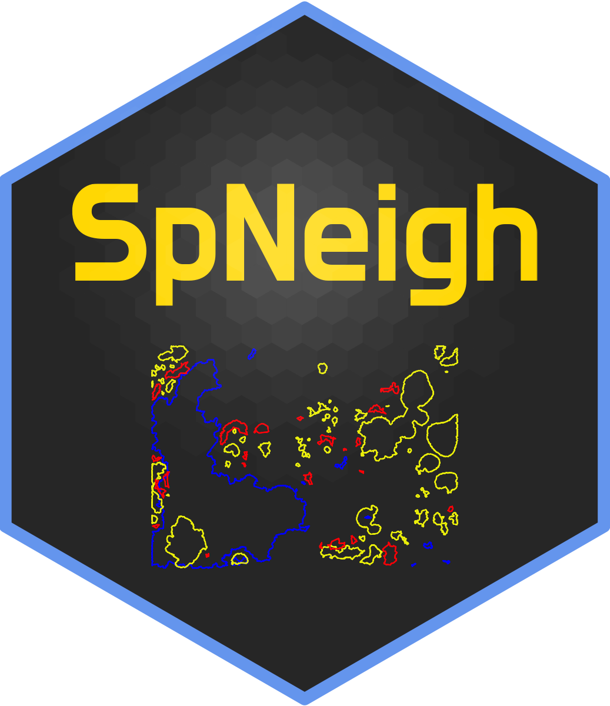

# SpNeigh 

SpNeigh provides methods for neighborhood-aware analysis of spatial
transcriptomics data. It supports boundary detection, spatial weighting
(centroid- and boundary-based), spatially informed differential
expression using spline-based models, and spatial enrichment analysis
via the Spatial Enrichment Index (SEI). Designed for compatibility with
Seurat objects, SpatialExperiment objects and spatial data frames,
SpNeigh enables interpretable, publication-ready analysis of spatial
gene expression patterns.

Quick start guide can be found
[here](https://jinming-cheng.github.io/SpNeigh/articles/SpNeigh.html).

## Installation

The *SpNeigh* package can be installed from GitHub by using:

``` r
devtools::install_github("jinming-cheng/SpNeigh")
```

## Citation

Please cite this article if you use SpNeigh:

Cheng, J.\*, Chow, P. K.H., and Liu, N.\*. “SpNeigh: spatial
neighborhood and differential expression analysis for high-resolution
spatial transcriptomics”. *bioRxiv* (2025).

(or use BibTex)

``` R
@article {Cheng2025SpNeigh,
    author = {Cheng, J. and Chow, P. K.H. and Liu, N.},
    title = {SpNeigh: spatial neighborhood and differential expression analysis for high-resolution spatial transcriptomics},
    year = {2025},
    doi = {10.1101/2025.11.07.687304},
    journal = {bioRxiv}
}
```
