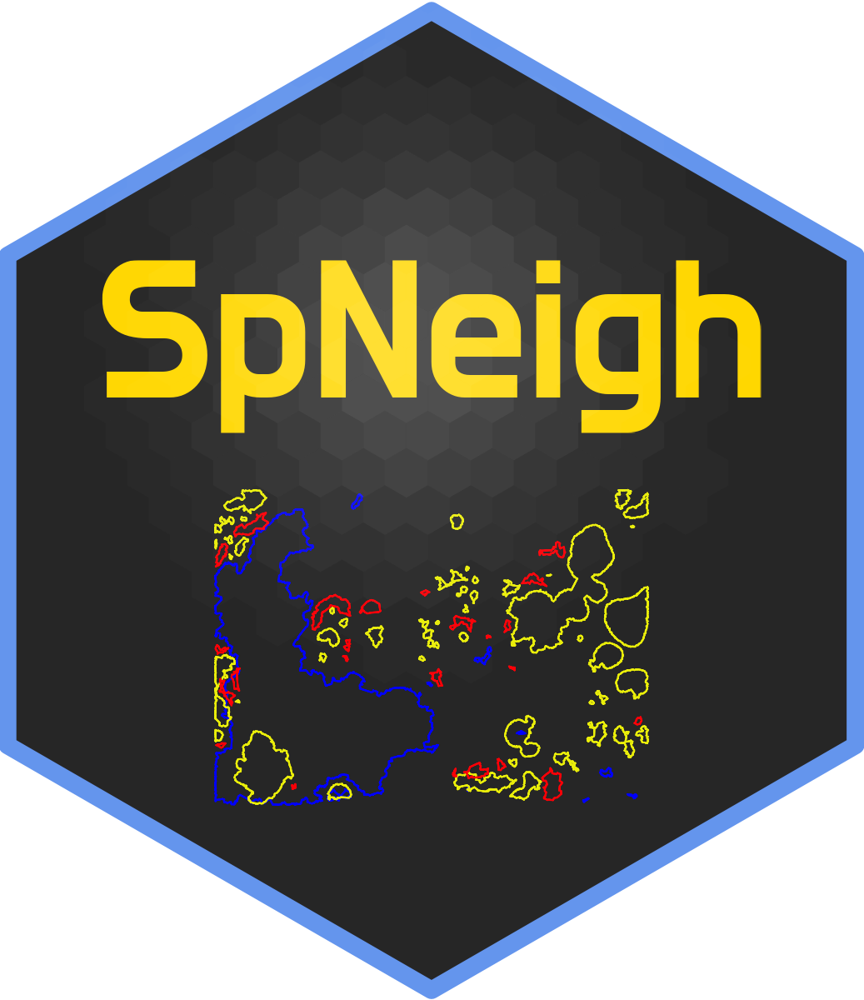

# SpNeigh 

SpNeigh provides methods for neighborhood-aware analysis of spatial
transcriptomics data. It supports boundary detection, spatial weighting
(centroid- and boundary-based), spatially informed differential
expression using spline-based models, and spatial enrichment analysis
via the Spatial Enrichment Index (SEI). Designed for compatibility with
Seurat objects, SpatialExperiment objects and spatial data frames,
SpNeigh enables interpretable, publication-ready analysis of spatial
gene expression patterns.

Quick start guide can be found
[here](https://jinming-cheng.github.io/SpNeigh/articles/SpNeigh.html).

## Installation

Install *SpNeigh* from Bioconductor

``` r
if (!requireNamespace("BiocManager", quietly = TRUE)) {
    install.packages("BiocManager")
}

BiocManager::install("SpNeigh")
```

Or install *SpNeigh* from GitHub:

``` r
devtools::install_github("jinming-cheng/SpNeigh")
```

## Citation

Please cite this article if you use SpNeigh:

``` R
To cite SpNeigh in publications, please use:

  Cheng J, Chow P, Liu N (2026). "SpNeigh: spatial neighborhood and
  differential expression analysis for high-resolution spatial
  transcriptomics." _NAR Genomics and Bioinformatics_, *8*, lqag039.
  doi:10.1093/nargab/lqag039 <https://doi.org/10.1093/nargab/lqag039>.

A BibTeX entry for LaTeX users is

  @Article{,
    title = {SpNeigh: spatial neighborhood and differential expression analysis for high-resolution spatial transcriptomics},
    author = {Jinming Cheng and Pierce Kah Hoe Chow and Nan Liu},
    journal = {NAR Genomics and Bioinformatics},
    year = {2026},
    volume = {8},
    pages = {lqag039},
    doi = {10.1093/nargab/lqag039},
  }
```
